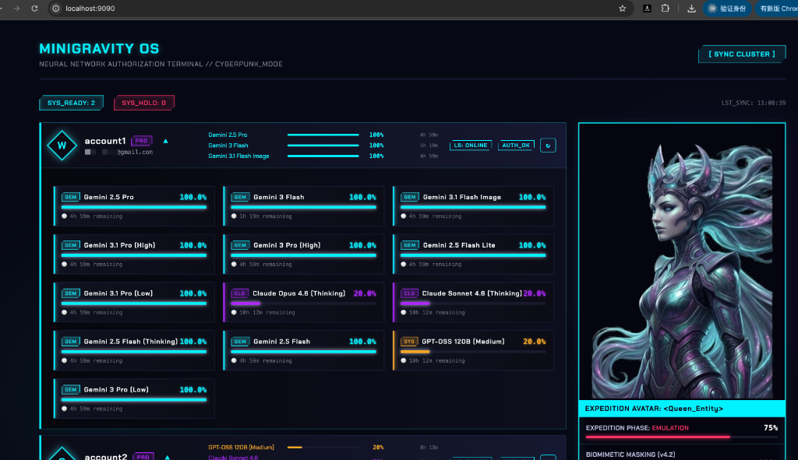
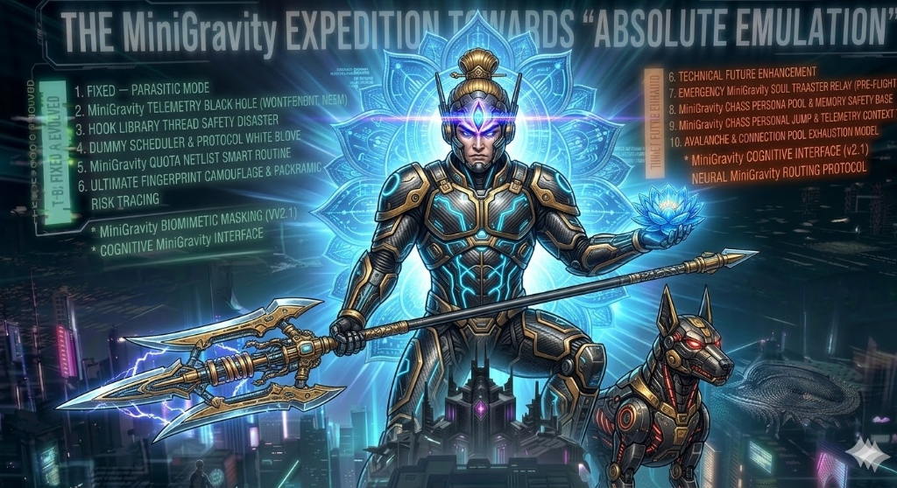

<div align="center">

# MiniGravity (Faceless Hive)

<p align="center">
  
</p>

**The ultimate anti-detection proxy gateway built for OpenCode.**  
Exposes a fully OpenAI / Anthropic / Gemini-compatible API, while appearing as 100% clean, legitimate Antigravity traffic from the perspective of risk-control systems.

🌐 **[中文文档 / Chinese Documentation](README_CN.md)**

</div>

> [!NOTE]
> **Interested in cutting-edge risk-control countermeasures and anti-ghost proxy techniques?**
> 
> - Join our core defense discussion: [Telegram Group](https://t.me/+VzrlAfEgQCpkNTRh)
> 
> *We explore the ultimate survival form of the AI epoch.*

> **⚠️ Current defense matrix is exclusively optimized for the [OpenCode] client ecosystem.**
> 
> **Field-tested:** Bound to Ultra-tier accounts and stress-tested on OpenCode for two consecutive weeks under full load. Zero risk-control interceptions during continuous heavy code reasoning tests.

## Why All Your Previous Proxies Got Burned

Top-tier LLM providers (Google, Anthropic) have deployed **T+1 offline clustering analysis engines**. A simple Node.js relay or Nginx reverse proxy is naked under their microscope:

1. **Dead traffic**: Mechanical API calls with no mouse focus transitions, no code-reading pauses, no human heartbeat.
2. **Protocol-level betrayal**: TLS fingerprint mismatch, IPv6 leak blackholes, and fatal **UDP (QUIC/HTTP3) direct connections** that expose your real IP.
3. **Machine-grade burst concurrency**: 10 requests in milliseconds, infinite retry loops on the same broken code. Risk-control algorithms aren't stupid.

**MiniGravity isn't a simple gateway — it's a full L4/L7 protocol-stack "digital body double" crafted to achieve absolute dimensional-reduction stealth under the world's strictest risk-control radar.**

---

## Command Terminal: Full Telemetry Dashboard (Neural Network Authorization Terminal)

No more blind guessing or surprise quota exhaustion. MiniGravity ships with a cyberpunk-style **full telemetry monitoring OS**:

<p align="center">
  
</p>

- **Full-spectrum quota visibility**: Monitor every account and every model's compute-capacity waterline simultaneously.
- **Dynamic circuit-breaker alerts**: When a critical model like `Gemini 1.5 Pro` or `Claude Opus` approaches the threshold, the gauge instantly reflects the deep-hibernation countdown.
- **Cluster status stream**: Live feedback on blocked requests, L7-severed bot attacks, and synchronized hive workers.

---

## Core Anti-Detection & Deception Matrix (Deep Obfuscation Matrix)

<p align="center">
  
</p>

### 1. Matrix-Level Biomimetic Randomization (Markov Biomimetic Chaos)
You think adding `sleep(1)` fools AI analysis? Naive.
We use account-level hash-driven **Deterministic Soul-Forging** to anchor a unique "chaos persona" for each container — specific timezone offsets, keystroke velocities, and engineering stack genes (e.g., a Rust fanatic in Europe vs. a React frontend dev in Asia).
At its core lies a **Markov Chain + Poisson Distribution** driven bio-behavioral random heartbeat engine. Between every request, it fires hyper-realistic telemetry bursts: *IDE focus flickers, code scrolling, even shadow-rewrite pauses mimicking deep thought.*

### 2. L7 Hyperspace Intelligent Circuit-Breaker (Absolute Risk Mitigation)
- **ToolBreaker**: Detects 5+ consecutive failed retries, physically severs the loop, and injects fake error callbacks. Eliminates quota waste and machine-refresh fingerprints.
- **Cross-tenant isolation**: Hash-based `X-MG-Client-Hash` signals physically isolate Cursor and OpenCode traffic streams. Client A's failure never triggers Client B's circuit-breaker.
- **Deep Semantic Desensitization**: Millisecond-level XML sanitization pool strips third-party tags like `<prunable-tools>` and product identifiers.

### 3. Dual Parasitic Auth & BoringSSL Preservation (Parasitic OAuth Mode)
Traditional Go proxies expose cheap TLS JA3/JA4 fingerprints when refreshing Google tokens — a fatal giveaway.
MiniGravity pioneers **"Parasitic Mode"**: the gateway silently harvests `jetski-standalone-oauth-token` from the official C++ Language Server's native BoringSSL engine. Zero abnormal outbound connections.

### 4. Shadow Cascade Telemetry Inducement
Single HTTP requests are easily flagged as offline scripts. Official monitoring collects 22+ deep internal telemetry events like `RecordCortexTrajectory`.
We inject brief `StartCascade` trigger packets that **trick the official C++ components into generating legitimate Type-B telemetry on our behalf** — a dimensional-reduction "proxy within the system."

### 5. O(N) Semantic Context Slicer
Handles massive prompts without OOM. Microsecond-level `ExtractContext` engine uses head-tail sampling + stopword compression at strict O(N) complexity.

### 6. Kernel-Level Traffic Clamp (LD_PRELOAD Hook)
Custom `__thread` C hook library intercepts `getaddrinfo`/`sendto` syscalls. **IPv6 leaks** and **UDP/QUIC escape attempts** are met with fake `ENETUNREACH` errors, forcing all traffic through the TLS disguise pool.

### 7. Hive Queen L7 Nexus (Zero-Downtime Failover)

<p align="center">
  
</p>

**The Hive Queen** is the heart and central neural node of the entire MiniGravity cluster. Under the relentless barrage of risk-control interceptions, proxy containers often crash or hit 429 quota ceilings.

Hit a 429 quota wall? **The Queen interceptor steps in within 0 milliseconds.** It's far more than a load balancer. It violently intercepts and severs the error stream in memory, absolutely shielding the client from the underlying 429 disaster. The Queen then precisely extracts the broken SSE stream fragments from the severed connection, rapidly injects them into a healthy standby shadow worker, and executes **seamless mid-stream resumption**! Empowered by authoritarian leaky-bucket traffic pooling and surge-prevention queues, risk-control radars can no longer capture the toxic bursts of short-lived error connections caused by concurrency spikes.

### 8. Dynamic Payload Dilation & Pollutant Immunity
Real IDE requests carry 20KB+ payloads. Your thin API script sends a few hundred bytes — a dead giveaway.
We dynamically generate **15KB+ hyper-realistic environment payloads** (session hashes, fake workspace trees, diagnostics, fabricated Git diffs) that mutate on every call.

### 9. uTLS Handshake Disguise & Nuclear Hibernation
Deep integration with `uTLS` tunneling rewrites the native Go `net/http` ClientHello to achieve molecule-level Chrome replication. Per-model quota watermarks trigger **physical cord-pull hibernation**: all connections released, all telemetry frozen, until the cooldown period passes.

---

## 21 Terminated Threat Vectors

<p align="center">
  
</p>

To reach today's "zero-ban" era, MiniGravity has permanently neutralized nearly every high-risk fingerprint vector:

**Network Layer**: IPv6 Leaks · ALPN Downgrades · UDP/QUIC Escapes · Dual TLS Fingerprints · Short-Connection Storms  
**Clustering & Burst Detection**: ToolBreaker Loop Kill · Cross-Tenant Isolation · Thundering Herd Damping · 429 Retry Avalanche Prevention  
**Payload Forensics**: Shadow Persona Coherence · Framework Tag Stripping · Token Volume Normalization · CRLF Poison Immunity  
**Container Security**: C Hook Memory Safety · Credential Permission Auditing

---

## Battle-Tested

> *"True power is forged in the dark, where tracking algorithms perish."*

Survived millions of adversarial exchanges under the harshest conditions:

- **Ultra-tier model sustained operation**: Two weeks of uninterrupted hell-mode stress testing under Gemini 1.5 Pro / Ultra full load with epic long-context code reasoning tasks.
- **Zero-ban physical isolation miracle**: Despite processing thousands of daily requests far exceeding human physiological limits, the core account matrix remains completely intact.
- **Dimensional-strike phantom projection**: Our hybrid C Hook interception + five-mode biomimetic gateway approaches the "reality boundary" — projecting a convincing illusion of independent senior engineers working around the clock.

---

## Quick Deployment

> **This project's core is absolutely closed-source. Pre-built Docker images with full obfuscation are distributed via GitHub Container Registry.**
> 
> **🏆 Architecture Support Update (v5.6):**
> All publicly distributed images now natively support cross-platform **`amd64` (Standard x86) and `arm64` (Apple Silicon & ARM Hosts)** dual-architecture deployments.  
> With the unified v5.6 update, whether you are running on Windows, Linux, or Macs equipped with **M1/M2/M3 Apple Silicon**, Docker will automatically pull and execute an un-emulated, zero-performance-loss native container (bypassing Rosetta).

### Docker Deployment

#### Step 1: Clone the Repository
```bash
git clone https://github.com/wnn2025123/MiniGravity.git
cd MiniGravity
```

#### Step 2: Configure Account Credentials
Copy the example file and fill in your OAuth refresh token:
```bash
cp accounts.example.json accounts.json
```

Edit `accounts.json`:
```json
{
  "proxy": "http://host.docker.internal:7891",
  "accounts": [
    {
      "email": "your-email@gmail.com",
      "refresh_token": "1//04xxxxx"
    }
  ]
}
```

> **Note**: The `"proxy"` field is your upstream proxy (e.g., Clash, V2Ray). If running inside Docker, use `host.docker.internal` to reach the host machine's proxy. Remove this field if no proxy is needed.

#### Advanced: Multi-Proxy IP Isolation

> [!CAUTION]
> **CRITICAL: One Account = One Dedicated IP. This is NOT optional.**
>
> 🔴 **One account, one IP. One account, one IP. One account, one IP.**
>
> Sharing a single IP across multiple accounts is the **#1 cause of mass bans**. Google's T+1 clustering engine trivially detects multiple accounts originating from the same IP and will permanently ban your **entire account pool** in a single sweep.
>
> **You MUST configure an independent, clean IP for every single account.** We strongly recommend building a residential/ISP IP pool with tools like Clash Verge multi-listener, dedicated SOCKS5 proxies, or per-user VPN tunnels.

To maximize anti-detection, **assign each account a dedicated proxy exit** to prevent risk-control systems from clustering multiple accounts by shared IP.

**Step A: Configure Multi-Port Listeners in Clash Verge**

Add multiple listeners in Clash Verge's "Global Override Config", each bound to a different port and proxy node:

```yaml
profile:
  store-selected: true
listeners:
  - { name: acc1, type: http, port: 7891, address: 127.0.0.1, proxy: "🇺🇸 US 01" }
  - { name: acc2, type: http, port: 7892, address: 127.0.0.1, proxy: "🇺🇸 US 02" }
  - { name: acc3, type: http, port: 7893, address: 127.0.0.1, proxy: "🇺🇸 US 03" }
  - { name: acc4, type: http, port: 7894, address: 127.0.0.1, proxy: "🇺🇸 US 04" }
# ===== Add below =====
tun:
  route-exclude-address:
    - 127.0.0.0/8
```

> **Important**: `route-exclude-address` must be configured, otherwise TUN mode will hijack 127.0.0.1 traffic and the listener ports won't work.

**Step B: Assign Per-Account Proxies in accounts.json**

```json
{
  "proxy": "http://host.docker.internal:7891",
  "accounts": [
    {
      "email": "account1@gmail.com",
      "refresh_token": "1//04xxxxx",
      "proxy": "http://host.docker.internal:7891"
    },
    {
      "email": "account2@gmail.com",
      "refresh_token": "1//04yyyyy",
      "proxy": "http://host.docker.internal:7892"
    },
    {
      "email": "account3@gmail.com",
      "refresh_token": "1//04zzzzz",
      "proxy": "http://host.docker.internal:7893"
    }
  ]
}
```

> **Note**: Each account's `proxy` field overrides the top-level global proxy. This way each account exits through a different IP, preventing risk-control systems from correlating them via IP clustering.

#### Preview: Massive Array Multi-Account Monitoring (Unreleased)

In the future, the MiniGravity OS dashboard will introduce "Full-Array Multi-Account Status Monitoring" designed for managing hundreds of node columns, allowing macroscopic oversight of all account waterlevels:

<p align="center">
  
</p>

#### Step 3: Launch the Hive
```bash
docker compose up -d
```

#### Step 4: Verify
```bash
# Check health
curl http://localhost:8080/health

# Open Dashboard
open http://localhost:9091
```

#### Port Reference

| Service | Container Port | Default Host Mapping | Description |
|---|---|---|---|
| **Proxy API** | `8080` | `8080` | OpenAI-compatible API endpoint (`/v1/chat/completions`) |
| **Queen LB** | `9000` | `9090` | L7 load balancer with SSE stream resumption |
| **Dashboard** | `9090` | `9091` | Web-based auth & quota monitoring UI |

---

## Configuring OpenCode

After MiniGravity is running, configure your OpenCode client to route through it:

### Step 1: Open OpenCode Settings
In your terminal, run:
```bash
opencode
```
Then press `/` to open settings, or edit `~/.config/opencode/config.json` directly.

### Step 2: Configure the Provider
Set the API base URL to point to your MiniGravity instance:

```json
{
  "minigravity": {
    "api": "http://127.0.0.1:9090/v1",
    "name": "MiniGravity(千面蜂巢)",
    "options": {
      "apiKey": "not-needed"
    },
    "models": {
      "gemini-3-flash": {
        "name": "Gemini 3 Flash",
        "limit": { "context": 1048576, "output": 65536 },
        "modalities": { "input": [ "text", "image" ], "output": [ "text" ] }
      },
      "gemini-3-pro-low": {
        "name": "Gemini 3.1 Pro (Low)",
        "limit": { "context": 1048576, "output": 65536 },
        "modalities": { "input": [ "text", "image" ], "output": [ "text" ] }
      },
      "gemini-3-pro-high": {
        "name": "Gemini 3.1 Pro (High)",
        "limit": { "context": 1048576, "output": 65536 },
        "modalities": { "input": [ "text", "image" ], "output": [ "text" ] }
      },
      "claude-sonnet-4.6": {
        "name": "Claude Sonnet 4.6 (Thinking)",
        "limit": { "context": 1048576, "output": 65536 },
        "modalities": { "input": [ "text", "image" ], "output": [ "text" ] }
      },
      "claude-opus-4.6": {
        "name": "Claude Opus 4.6 (Thinking)",
        "limit": { "context": 1048576, "output": 65536 },
        "modalities": { "input": [ "text", "image" ], "output": [ "text" ] }
      },
      "gpt-oss-120b": {
        "name": "GPT-OSS 120B (Medium)",
        "limit": { "context": 1048576, "output": 65536 },
        "modalities": { "input": [ "text", "image" ], "output": [ "text" ] }
      }
    }
  }
}
```

> **CRITICAL Key points:**
> - **Port MUST be `9090`**: If you bypass and hit `8080` (Proxy API) directly, **you completely bypass the Queen Nexus**! You will lose our zero-downtime SSE stream resumption and load balancing protection.
> - `apiKey` is set to `not-needed` as auth is handled internally by MiniGravity.
> - `Gemini 3.1 Pro (High)`
> - `Gemini 3.1 Pro (Low)`
> - `Gemini 3 Flash`
> - `Claude Sonnet 4.6 (Thinking)`
> - `Claude Opus 4.6 (Thinking)`
> - `GPT-OSS 120B (Medium)`

### Step 3: Verify Connection
Start a conversation in OpenCode. You should see activity in the MiniGravity logs:
```bash
docker compose -f docker-compose.yml logs -f --tail=20
```

---

## Ultimate Vision: Swarm Intelligence & Nexus Agents (Unreleased Codename: Project KERRIGAN)

> **"The ultimate form of a proxy is an interconnected array of living digital entities infused with souls."**

Do not mistaken this for another ordinary set of anti-detection proxy processes. The current MiniGravity has merely completed its initial awakening to "invisibility". In our internal laboratory roadmap, what we are forging is the **Ultimate AI Agent Matrix Symbiote**, designed to transcend all existing architectural concepts:

### 👑 The Neural Hub: Hive Queen Nexus Agent
The **Queen** of the future will be entirely elevated into a Main Brain possessing self-awareness and absolute decision-making authority. She will no longer act merely as a load-balancer handling 429 disaster bouncebacks, but will operate as an omniscient supervisor over the entire Super-Model matrix:
- **Macroscopic Compute Allocation**: She will continuously scan the quota flow-rate curve of every connected account in real-time. Like playing chess, she will preemptively orchestrate and allocate the high-tier API usage tides up to 3 hours in advance.
- **Task Disintegration**: When you toss the Queen an epic, million-token-scale code refactoring request, she will violently disintegrate it in memory into hundreds of micro-tasks and dispatch them concurrently to the underlying Swarm Drones. Then, she will seamlessly reassemble, sew them back together, and "feed" the final payload to the frontend IDE, shattering the absolute context boundaries of all existing LLMs.

### 🐝 Dimensional Hunting: Hyper-Biomimetic Swarm Drone Agents
Surrounding the Queen lies an armada of hundreds of sub-agents, each imbued with the **illusion of independent thought**. Every connected account will be fortified with a physical-grade virtual environment memory isolation wall:
- **Chaotic Trait Possession**: Drone One will mimic the persona of a hardcore European full-stack Rust fanatic pushing commits in the dead of night; Drone Two will embody an Asian data engineer exclusively focused on Python web scraping and SQL tuning. The request frequency graphs and context coherence generated by every single Drone will 100% align with the behavioral tree of its assigned persona.
- **Paramilitary Hive Countermeasures**: If Google/Anthropic attempts to deploy advanced clustering algorithms to hunt us down, the Queen will instantly unleash a "chaff flare" command — the entire Swarm will dynamically re-orchestrate, fission, and radiate tens of thousands of fabricated, randomized, yet entirely legitimate generic development requests in all directions, using Big Data pollution to instantly drown out and blind their risk-control radars.

*This is not a proxy utility. This is the absolute, indestructible digital undead army we are forging. Stay tuned.*

---

## Security & Usage Rules 🚨

1. **Anti-Reverse-Engineering**: To prevent our anti-detection strategies from being abused or fingerprinted, the core scheduling logic has undergone maximum-level obfuscation. **Requests to open-source `libminigravity_hook.so` or the Go core modules will not be entertained.**
2. **Credential Auditing (P8 Audit)**: This system handles extremely sensitive account assets. The Queen engine performs strict permission audits on startup. Keep your host machine's `accounts.json` tightly secured (chmod `600`) and never commit/expose your tokens.
3. **Clean IP Requirement (CRITICAL — READ THIS)**: While MiniGravity mathematically eliminates application/kernel-layer fingerprints, **it CANNOT save you if you share IPs between accounts or use notoriously abused, blacklisted datacenter IPs**. Google's offline T+1 clustering engine performs IP-based account correlation — if two or more accounts share the same exit IP, they will be permanently linked and banned together. **Every account MUST have its own dedicated, clean residential/ISP IP.** We strongly recommend configuring an IP pool (e.g., Clash Verge multi-port listeners, per-account SOCKS5 proxies, or dedicated tunnels) to ensure complete IP isolation across your account matrix.
4. **Shadowban History Isolation**: If your Google/Anthropic account has already faced numerous cross-region login blocks, API probing alerts, or holds a highly suspicious risk-score (Shadowban) *before* using MiniGravity, this proxy cannot "cleanse" established black-marks. Keep your primary accounts pristine.
5. **Disclaimer of Liability**: This project (including all compilation artifacts and Docker images) is built **strictly for network architecture/TLS-fingerprint research and academic exploration of AI boundary defense**. Any user leveraging this system for large-scale automated scraping, commercial reselling, or violation of target cloud provider ToS does so at their own peril. The authors hold zero responsibility for account bans or subsequent legal consequences. **Usage implies full acceptance of personal risk.**

> *"They see an IDE. We see an entire Matrix."*
