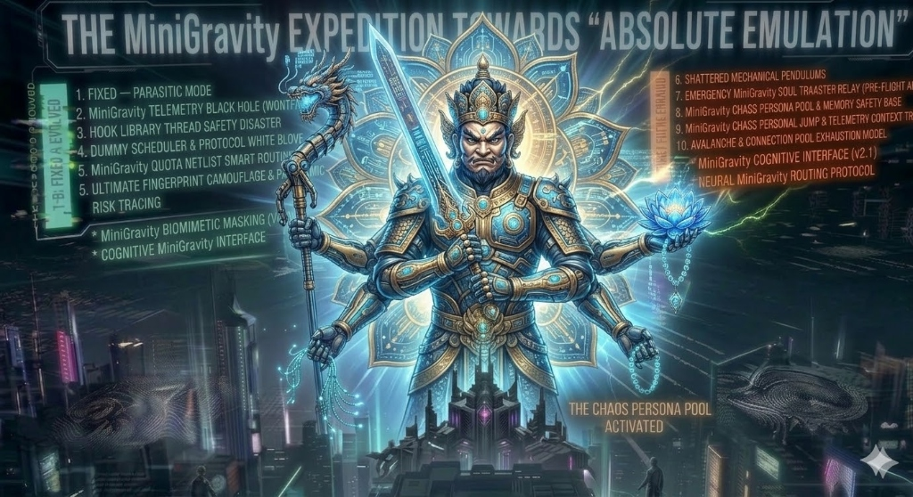

<div align="center">

# MiniGravity (Faceless Hive)

<p align="center">
  
</p>

**专为 OpenCode 打造的高能反追踪代理流量网关。**  
提供完全兼容 OpenAI / Anthropic / Gemini 的外部调用接口，但在风控的上帝视角里，这仅仅是一份 100% 纯净、合规的官方 Antigravity 流量。

🌐 **[English Documentation](README.md)**

</div>

> [!NOTE]
> **渴望深入探讨极致的风控对抗与反幽灵代理技术？**
> 
> - 欢迎加入我们的核心防御交流群：[点击加入 Telegram 讨论群组](https://t.me/+VzrlAfEgQCpkNTRh)
> 
> *我们只探索人工智能纪元的最终极存活形态，寻找同道中人。*

> **⚠️ 核心限定：当前防御矩阵仅深度适配并独占支持 [OpenCode] 客户端生态。**
> 
> **实装测试纪要：** 已绑定 Ultra 权限账号群组，挂载于 OpenCode 连续半个月昼夜满负荷抗压洗炼。不间断重型代码推演测试下，未受任何风控拦截。

## 为什么你之前的代理都成了炮灰？

当前最顶尖的 LLM 服务商（如 Google、Anthropic）早已部署了 **T+1 级别的机器聚类离线分析引擎**。你以为随随便便搞个 Node.js 转发、或者搞个 Nginx Reverse Proxy 就能白嫖算力？在风控引擎的显微镜下，你的自动化请求就像是在“裸奔”：

1. **死气沉沉的流量**：只会机械地调 API，没有鼠标焦点的穿梭，没有代码阅读的停顿，缺乏人类的心跳。
2. **底层协议的赤裸出卖**：TLS 指纹分裂、IPv6 泄漏黑洞，甚至致命的 **UDP (QUIC/HTTP3) 绕路直连**，直接把你的真身 IP 与工具属性卖给了 WAF！
3. **机器级别的夺命并发**：毫秒内齐发 10 个请求，遭遇 429 报错时死循环重试同一个无效代码 50 次。这种“盲目且高频”的单特征，你当风控系统的算法是智障吗？

**MiniGravity 不是一个简单的网关，它是一套我们在 L4/L7 协议栈上为你量身打造的“硅胶倒模的数字替身”。** 它的诞生仅仅因为一个信仰：在地球上最严密的风控雷达下，**实现降维级别的绝对隐身**！

---

## 统御级终端：全景算力液位遥测大屏 (Neural Network Authorization Terminal)

不再需要黑盒盲猜，也没有额度耗尽时的错愕。MiniGravity 自带一套极具赛博风格的 **全景算力与鉴权监控 OS**：

<p align="center">
  
</p>

- **全维度额度透视**：同时监控矩阵中每一个账号、每一颗独立模型的算力水位与健康度。
- **动态熔断告警**：当某个核心的 `Gemini 1.5 Pro` 或者 `Claude Opus` 触碰水线警戒，表盘将立即反映其进入深层次休眠状态的倒计时估算。
- **集群状态流**：直观反馈当前处于拦截状态的废弃请求数、被 L7 分析层物理切断的机刷攻击以及同步就绪的蜂巢 Worker。

---

## 核心“反侦察与欺骗”矩阵 (Deep Obfuscation Matrix)

<p align="center">
  
</p>

### 1. 矩阵级生物态伪装：隐秘突变与混沌人设 (Biomimetic Chaos)
你以为加个延时就能骗过云端分析？天真。
我们将为每个容器锚定独一无二的“混沌人设”。这包括特定的时区偏差、操作手速与交互习惯（比如：一个在欧洲区的极客，和一个在亚洲区的前端）。
不仅仅是延时，底层的核心是一套**基于高级特征突变算法**驱动的高维**生物态随机心脏**。在每一次请求流转间隙，它都会以极度贴合真实人类作息的概率突发向服务器发送环境包：*如焦点切换、页面滚轮滑动、甚至是假装陷入深思的停顿*。
这就是极致的**生物态仿生**！哪怕你在一秒内产生极高频压测，在 T+1 离线聚类的审计看来，这绝不是简单的脚本机器，而是一群不同国度的活人恰好在同一微秒按下了回车！

### 2. L7 超空间智能熔断与风险阻断 (Absolute Risk Mitigation)
风控的审查绝不仅限于查封网络流，它还查你 AI 工具犯蠢的动作！如果你的第三方大模型代理陷入语法死循环，一分钟内向服务器连发 50 次同样的错误指令，这直接就是自杀式的机刷指纹。
我们在 L7 层重兵把守，构筑了严苛的风险过滤网：
*   **智能重试防连封**：内置智能熔断器，敏锐防御无脑机器死循环。一经触发，物理切断源头暴露点！100% 杜绝配额空耗并切除“机器循环图谱”。
*   **高维度物理隔离**：核心底层会自动实施专有协议穿透来达到物理隔离目的。局部账号被阻断不会牵连影响全局账号池，防御体系稳如泰山。
*   **深层内容脱敏清洗 (Deep Semantic Desensitization)**：我们构筑了毫秒级的安全文本脱敏池。诸多外部代理框架悄悄塞在文本里的机器标识或敏感标签，均会在本层遭到彻底洗消过滤。在云端视角，这堪称 100% 完美无垢！

### 3. 双引擎架构：原生通道推理与 uTLS 寄生模式 (Dual-Engine Architecture)

传统的 Go 代理在请求流转时，会暴露标准库极为廉价的 TLS JA3/JA4/HTTP2 指纹，这是致命的风控送分题。
MiniGravity 当前支持双重降维打击模式，你可以根据不同的风控烈度无缝部署切换：

<p align="center">
  
</p>

> ### 👑【核心主推】🔥 终极形态：原生通道推理 (Native Channel Inference / v6.0-ls+)
> **🚨 主打：绝对的零特征网络通信 + 全系封闭多模型强行解锁 🚨**
> 
> **将所有大模型推理任务无缝融入官方原生组件的执行流中，全权使用官方自带的最纯正加密栈发起通信！** 
> 从云端防御审计的上帝视角看，你的第三方代理流量特征将**真正意义上暴跌为绝对的零**。此模式强势霸道解锁 Claude Sonnet/Opus、GPT-4o、Gemini 等全系多模型通道！
> 
> #### 🕷️ 幽灵形态：uTLS 寄生模式 (Parasitic Mode / v5.9)
> **主打：深度隐蔽 + 极限环境兜底**
> 仅让官方组件充当宿主处理“鉴权打杂（定期刷 Token、发心跳遥测）”事务。网关彻底斩断自身的危险外链，依托多重伪装与极致魔改的 uTLS 链路将主模型推理请求神不知鬼不觉地送达服务器，作为应对极端风控阻击网的坚实后盾。

### 4. 影子状态欺骗与高维轨迹补全 (Shadow Telemetry Inducement)

<p align="center">
  
</p>

单一的 HTTP 请求很容易被判定为脱机脚本。官方的监控引擎会搜集深层复杂的大规模关联行为埋点。
我们并未选择吃力不讨好地去正向反编译协议漏洞，而是直接运用极短促的智能触发展现包。这种**影子行为遥测**机制会巧妙地诱发并驱动底层框架机制，安全自动地为我们生成并向系统深处输送完整、合法、带极高可信授权权重的底层因果链图谱。这实现了降维级别的数据渗透补全闭环！

### 5. 全感应动态语义重塑层 (Semantic Context Slicer)
处理超大超额文本经常导致运行端过载。我们在其中搭建了极轻量级特征调度引擎，采用高度自适应采样算法以抽离核心层中最集中的强特征意图逻辑流，并无缝倒流向动态扰动器中。在抵御内部运行损耗保证长会话低延迟时，最大程度规避因死搬硬套的文本聚类而引发全系封控！

### 6. 底层出站强制防溢出钳制 (Traffic Clamp)
我们全面置入了极深层、无法被简单探查的动态保护墙矩阵机制。
任何想要在暗箱深处脱离安全隧道直连的行为——无论是可能暴漏所有成员底池的非法协议溢出黑洞，还是悄然发生试图穿越本地屏蔽代理环境的高维越狱——全在它触碰到边界系统之时立刻遭遇了**严密封堵狙杀**！我们通过强制重写安全连接点协议与深度系统欺骗，切断高危试探信道，致使流浪流量只能规矩坠降至我们的加密控制水域中。

### 7. 千面蜂后跨维度断点续传 (Hive Queen L7 Nexus)

<p align="center">
  
</p>

**蜂后（Queen）**是整个 MiniGravity 集群的心脏与脑神经节点。面对极其频繁的封控和风控拦截，代理容器往往会频繁死掉或遇到 429 配额触顶。

遇到了 429 额度触顶断流？**Queen 调度器会在 0 毫秒内介入接管机制。** 它不仅是简单的负载均衡，它会在内存中狂暴地拦截并斩断报错流，对外绝对隐瞒发生于底层的 429 灾难。然后，Queen 会精准提取当前大模型断开的残骸碎片数据，无缝将其注塞入另一个目前算力处于完全健康状态的影子 Worker 进行转移处理，执行**无缝原位复活续传 (SSE Stream Resumption)**！凭借极权级的流量统筹漏桶和防浪涌排队器，风控雷达再也抓不住任何因并发激增、连接阻断而激发的病态短连接报错群像。

### 8. 动态载荷十倍膨胀与免疫净化 (Payload Dilation & Pollutant Immunity)
真实 IDE 的请求载荷动辄两万字节，你写个单薄的 API 调用脚本才几百字节参数，画像特征过于苍白。
我们会在请求穿刺而过的一瞬，强行**动态生成长达 15KB+ 的巨型超仿真环境包底**（动态跳变的 Session Hash、随机捏造的工作区文件树、环境 Diagnostics 分析甚至是虚构的 Git 变动碎片）！每次调用的体量和结构 100% 变幻莫测，彻底瘫痪掉对方的文本重放审计 (Dedup Detection)。
结合全局自动触发的 `cleanEnv`，哪怕你带着含有剧毒的 Windows `\r` 换行符试图连接集群，也会在触碰边界的瞬间被蒸发免疫。

### 9. uTLS 握手伪装 与 核灾级物理休眠 (BoringSSL & Total Hibernation)
深度集合并魔改了 `uTLS` 隧道，用最底层的暴力手段抹除并覆盖掉原生 Go `net/http` 暴露出的劣质 ClientHello 指纹，无论是 TLS 扩展请求次序还是密码套件名单，全部与最新版 Google Chrome 实现了分子级的复刻。
不仅如此，这套系统支持针对每个独立模型设立悬顶剑（例如预设 `gemini-1.5-pro` 的熔断清算红线为 60% 算力池）。触碰水位的瞬间，集群即执行**切断主动脉的物理级拔管休眠 (Hibernation)**——主动切断释放一切连接池，冻结一切仿真心跳假象，在风控雷达网中彻底原地消融，直到安全冷却期度过后，顺应高频潮汐波峰再度苏醒。

---

## 降维碾压：21项已被物理阻断的致命风控向量 (Terminated Threat Vectors)

<p align="center">
  
</p>

为了达到今日的“零封号”纪元，MiniGravity 团队在这场暗网攻防战中，踩平了世界上几乎所有 LLM 代理框架都无法逾越的深坑。以下为部分已被我们**永久斩杀**的高危风控雷区指纹（节选自我们的内部防御评估报告）：

### 网络通信底层漏洞
- **[破除] P0: IPv6/异域泄漏黑洞** —— 绕过通用连接导致的裸漏。已在最底层逻辑级别完全强制降维封锁。
- **[破除] P15: 通用指纹矛盾突变** —— 由于强行模拟上游指纹但底软配置脱节遗留的破绽。已完全适配全通透高仿隧道。
- **[破除] P18: 底层逃逸与旁路绕过** —— 通过隐藏端口等绕开基础代理配置产生的危险动作。已完成强制底层隔断控制。
- **[破除] P19: 多重环境指纹暴露** —— 当常规重传遇上下层校验更新引发身份验证冲突。现已合并执行统一脱敏再封包。
- **[破除] P21: 高频密集短时风暴** —— 无度狂刷引发服务器断崖查杀雷达红线波峰。现由调度阵列池化无缝消化吸收。

### 大数据聚类与并发突发特征
- **[破除] P10: 报错请求极速穿甲** —— 依托独裁性快速重试防封禁模型及引入底层随机抗抖动能力成功熨平波峰。
- **[破除] P13: 全生态身份混扎连坐** —— 通过注入加密化信号区切分开框架不同导致的识别连坐惩罚，真正物理切割。
- **[破除] P14: 集群羊群效应涌流** —— 当超大体量调用聚集在毫秒间激发的暴击峰值，被我们的深度限容器进行了降维调配消化。
- **[破除] P2: 断点雪崩综合绝路反噬** —— 在超量触顶阶段带来的大流量错峰灾难堆积阻断，已平滑融入矩阵被提前物理缓释保护。

### 载荷深度取证与内容语义污染
- **[破除] P5: 行为特征判定双重断层** —— 本身指令与内部意向操作差异引发的判断违和。采用统一环境底层阵列重新洗脸覆盖！
- **[破除] P9: 三方附加标签越界泄露** —— 有些环境携带独有的重度自动化指令残骸标签问题。这已被 L7 安全过滤器深彻全清理。
- **[破除] P16 & P20: 载体承压指纹落差极寒** —— API 的干瘪小数据相对官方宏大海量体积显得弱不禁风。引入补齐模块对其动态超增量膨胀进行去重反补漏洞！
- **[破除] P3: 平台污染死角漏洞雷区** —— 由某些桌面系统不可见非法数据携带进而引发大层死锁的隐藏雷区炸弹已由运行清屏技术清道扫雷。

### 底层系统架构与数据越权
- **[破除] P7: 跨层防崩溃连带锁定** —— 操作干预不当最易留下连带引发的组件严重错误痕迹供溯源，现加入系统级无缝平缓拦截解决。
- **[破除] P8: 分片数据降维验证漏洞** —— 阵列密钥存放区由于配置错误或环境交错遭受渗透！引驻 P8 等级安全强制审核隔离。

---

## 史诗级实战检验：向死而生的巅峰抗压 (Battle-Tested)

> *"True power is forged in the dark, where tracking algorithms perish."*

不要拿市面上那些见光死的“玩具转发器”与我们比肩。本系统已在暗网级别的严酷高压环境中存活了成百上千万次的拉锯对抗。最具标志性的皇冠之战是：

**全量承载大魔王 Gemini 1.5 Pro / Ultra 的地狱级满负荷轰炸！**

*   **Ultra 级巅峰模型的霸体续航**：在近半个月无间断的地狱级压测中，当所有常态代理早已暴毙数百回时，MiniGravity 宛如吞噬光线的数字黑洞，静默承载了天量级的史诗长上下文 (Long-context) 和庞大系统级架构的代码推演任务。顶着 Google 官方最高优先级 T+1 离线追溯清算机制，屹立不倒持续高光运转。
*   **零封号的物理隔绝奇迹**：哪怕我们处理了每天成千上万次远超生理极限的异常强度操作指令请求，由于极强伪防关联能力以及动态波动算法的作用，“封号”二字至今未能降临核心账号矩阵区域！
*   **降维级数据拟态投射**：这史诗般的阶段性胜利完美佐证了唯一的现实——由于核心防御的立体全栈保护矩阵拦截过滤下完成了彻底的指鹿为马。向各大高敏雷达云阵列系统中安全反馈输出了等同庞大正规企业研发群体正常交互运作般的极其合规的幻象数据表。

---

## 快速部署 (Deployment)

> **警告：本项目核心层为绝对闭源设计（Closed-Source）。通过 GitHub Container Registry 提供高度混淆并剥离符号表的预构建 Docker 镜像。**
> 
> **🏆 架构支持说明 (v5.6 更新)：**
> 当前所有线上发行的公共镜像均已支持 **`amd64` (标准 x86) 和 `arm64` (Apple Silicon / ARM 主机)** 多架构原生部署。  
> 这意味着在最新的 v5.6 统合版本中，无论你在 Windows/Linux 环境，还是配备了 **M1/M2/M3 等苹果芯片的 Mac** 电脑上运行，Docker 都将自动为你拉取并运行零性能损耗、**绝非 Rosetta 模拟**的纯原生高效容器！

### Docker 部署

#### 步骤 1: 拉取项目
```bash
git clone https://github.com/wnn2025123/MiniGravity.git
cd MiniGravity
```

#### 步骤 2: 配置账号与代理
复制一份示例配置文件：
```bash
cp accounts.example.json accounts.json
```

编辑 `accounts.json`，在最外层填入你的上游代理（如无则留空），并放入提取自官方组件的 OAuth 刷新令牌：
```json
{
  "proxy": "http://host.docker.internal:7891",
  "accounts": [
    {
      "email": "shadow1@gmail.com",
      "refresh_token": "1//04xxxxx"
    }
  ]
}
```
> **提示**：如果上游代理运行在宿主机（如 Clash/V2Ray），使用 `host.docker.internal` 即可让 Docker 容器内的流量走到系统代理。

#### 进阶：多代理 IP 隔离

> [!CAUTION]
> **极度重要：每个账号必须使用独立 IP，这不是可选项！**
>
> 🔴 **一个账号一个 IP！一个账号一个 IP！一个账号一个 IP！**
>
> 多个账号共享同一个 IP 是导致大规模封号的**第一大原因**。Google 的 T+1 离线聚类引擎能轻松检测到多个账号来自同一 IP，并会一次性永久封禁你的**整个账号池**。
>
> **强烈建议配置 IP 池，为每个账号分配独立的纯净家宽/ISP IP。** 可以使用 Clash Verge 多端口监听、独立 SOCKS5 代理或每用户独立 VPN 隧道等方式实现。

为了最大化反检测能力，**强烈建议为每个账号分配独立的代理出口**，避免多个账号共享同一 IP 被风控聚类关联。

**步骤 A：在 Clash Verge 中配置多端口监听**

在 Clash Verge 的「全局扩展覆写配置」中添加多个 listeners，每个绑定不同端口和代理节点：

```yaml
profile:
  store-selected: true
listeners:
  - { name: acc1, type: http, port: 7891, address: 127.0.0.1, proxy: "🇺🇸 美国 01" }
  - { name: acc2, type: http, port: 7892, address: 127.0.0.1, proxy: "🇺🇸 美国 02" }
  - { name: acc3, type: http, port: 7893, address: 127.0.0.1, proxy: "🇺🇸 美国 03" }
  - { name: acc4, type: http, port: 7894, address: 127.0.0.1, proxy: "🇺🇸 美国 04" }
# ===== 在下面加这段 =====
tun:
  route-exclude-address:
    - 127.0.0.0/8
```

> **注意**：`route-exclude-address` 必须配置，否则 127.0.0.1 的流量会被 TUN 模式劫持，导致监听端口无法正常工作。

**步骤 B：在 accounts.json 中为每个账号指定独立代理**

```json
{
  "proxy": "http://host.docker.internal:7891",
  "accounts": [
    {
      "email": "account1@gmail.com",
      "refresh_token": "1//04xxxxx",
      "proxy": "http://host.docker.internal:7891"
    },
    {
      "email": "account2@gmail.com",
      "refresh_token": "1//04yyyyy",
      "proxy": "http://host.docker.internal:7892"
    },
    {
      "email": "account3@gmail.com",
      "refresh_token": "1//04zzzzz",
      "proxy": "http://host.docker.internal:7893"
    }
  ]
}
```

> **说明**：每个账号的 `proxy` 字段会覆盖顶层的全局代理。这样每个账号走不同的出口 IP，风控系统无法通过 IP 聚类将它们关联。

#### 预览：超大阵列多账号全景监控 (未开放版本)

未来，MiniGravity OS 控制台将引入支持高达百级节点列队的「全阵列多账号状态监控」大屏支持，帮助你宏观掌控所有账号的水位：

<p align="center">
  
</p>

#### 步骤 3: 唤醒蜂巢集群
使用 Docker Compose 一键拉起：
```bash
docker compose up -d
```

#### 步骤 4: 检查验证与端口说明
集群启动后，你可以通过以下方式验证并使用系统：

| 服务 | 容器内端口 | 默认宿主机映射 | 作用说明 |
|---|---|---|---|
| **Proxy API** | `8080` | `8080` | OpenAI 兼容 API 入口 (`/v1/chat/completions`)；同时提供健康检查 `/health` |
| **Queen LB** | `9000` | `9090` | L7 调度层及模型续传接口 |
| **Dashboard** | `9090` | `9091` | 全景算力看板 UI。在浏览器打开 `http://localhost:9091` 即可访问 |

```bash
# 检查 API 健康状态
curl http://localhost:8080/health

# 查看运行日志
docker compose logs -f --tail=20
```

---

## OpenCode 接入指南

在确保 MiniGravity 已经启动且 `Queen LB (9090)` 正常工作后，请配置 OpenCode 将模型请求转发至本地网关：

### 1. 打开 OpenCode 配置文件
在终端输入命令 `opencode` 后，键盘按下 `/` 唤出设置；或者直接修改 `~/.config/opencode/config.json` 配置文件。

### 2. 配置本地网关 Provider
在配置中添加/修改 `minigravity` 作为 provider，使其指向本地的 Queen 节点 `9090` 端口：

```json
{
  "minigravity": {
    "api": "http://127.0.0.1:9090/v1",
    "name": "MiniGravity(千面蜂巢)",
    "options": {
      "apiKey": "not-needed"
    },
    "models": {
      "gemini-3-flash": {
        "name": "Gemini 3 Flash",
        "limit": { "context": 1048576, "output": 65536 },
        "modalities": { "input": [ "text", "image" ], "output": [ "text" ] }
      },
      "gemini-3-pro-low": {
        "name": "Gemini 3.1 Pro (Low)",
        "limit": { "context": 1048576, "output": 65536 },
        "modalities": { "input": [ "text", "image" ], "output": [ "text" ] }
      },
      "gemini-3-pro-high": {
        "name": "Gemini 3.1 Pro (High)",
        "limit": { "context": 1048576, "output": 65536 },
        "modalities": { "input": [ "text", "image" ], "output": [ "text" ] }
      },
      "claude-sonnet-4.6": {
        "name": "Claude Sonnet 4.6 (Thinking)",
        "limit": { "context": 1048576, "output": 65536 },
        "modalities": { "input": [ "text", "image" ], "output": [ "text" ] }
      },
      "claude-opus-4.6": {
        "name": "Claude Opus 4.6 (Thinking)",
        "limit": { "context": 1048576, "output": 65536 },
        "modalities": { "input": [ "text", "image" ], "output": [ "text" ] }
      },
      "gpt-oss-120b": {
        "name": "GPT-OSS 120B (Medium)",
        "limit": { "context": 1048576, "output": 65536 },
        "modalities": { "input": [ "text", "image" ], "output": [ "text" ] }
      }
    }
  }
}
```

> **注意事项（极其重要）：**
> - **端口必须是 `9090`**：直接连 `8080` (Proxy API) 会导致你**直接绕过 Queen 主节点**！你将无法享受到断点续传 (SSE Resumption) 和多账号负载均衡兜底带来的零感断流体验。
> - **`apiKey`**: 填写 `not-needed` 即可，鉴权由底层的 MiniGravity OAuth 管理池接管。

### 3. 测试调用
在 OpenCode 的聊天面版输入问题，如果一切正常，应该能在后台看到 `[MiniGravity]` 打印出来的请求流转及伪装日志。

---

## 终极宏图：蜂群思维与主脑智能体 (未公开代号：Project KERRIGAN)

> **"代理的尽头，是被注入灵魂的活体数字生命阵列。"**

不要以为这只是一组反侦察的 Proxy 进程。目前的 MiniGravity 仅仅完成了“隐形”的初步觉醒，而在内部实验室的路线图中，我们正在构筑的，是凌驾于所有现有产品之上的**终极 AI Agent 矩阵共生体**：

### 👑 神经枢纽：千面蜂后主智能体 (The Queen Nexus Agent)
未来的 **Queen** 将彻底拔高至拥有自我意识和决策权的主脑高度。她不再仅仅处理负载与 429 容灾反弹，而是作为一个凌驾于全局的超级大模型监控官：
- **算力宏观调配**：她将实时扫描所有帐号的额度流速曲线，像下棋一样提前 3 小时精准调配高阶 API 的使用潮汐机制。
- **任务统筹粉碎**：当你丢给 Queen 一个史诗级的百万级代码重构请求时，她会直接在内存里将其粉碎成成百上千个微型任务并发给底层蜂群执行，最后再由她组装缝合后“喂”给前端 IDE，打破所有大模型的上下文生命结界。

### 🐝 降维猎杀：全拟真蜂群多智能体 (Swarm Drone Agents)
围绕着 Queen，是成百上千个拥有**独立思维假象**的子智能体。每个接入的账号，都将被赋予物理级别的虚拟环境记忆隔离墙：
- **混沌特征附体**：一号 Drone 将模仿极度偏爱 Rust 且在深夜提交代码的欧洲全栈狂人；二号 Drone 则是一个只研究 Python 爬虫和 SQL 调优的亚洲数据工程师。每个 Drone 产生的请求频图、上下文连贯性全部 100% 符合作者的行为树。
- **群体自组织反制**：如果 Google/Anthropic 尝试启用高级聚类算法围剿我们，Queen 会瞬间释放“干扰弹”命令——整个蜂群会立刻自编排、自裂变，向四面八方散发几万组伪造的、随机的、完全合法的正常研发请求，利用大数据污染直接淹没风控雷达。

*这不是代理工具，这是我们要打造的绝对不可被消灭的数字亡灵军团。敬请期待。*

---

## 安全与使用须知🚨

1. **底层机密防拆锁定**：为防止风控研究技术被黑产恶意提取利用或样本泄漏反被打击，系统层运行架构等敏感模块已实施全维闭环黑箱剥离保护。**拒绝一切对底层深度运作流与协议安全破解的开源指点和过度揭秘要求。**
2. **凭据强审计 (P8 Audit)**：系统处理的是极其敏感的账号资产。Queen 引擎在启动时会执行严苛的安全审计。请确保你在宿主机上的 `accounts.json` 权限严格控制（建议 `600`），不要将包含 Token 的配置文件上传或泄露。
3. **节点 IP 纯净度要求 (极度重要 —— 必读)**：MiniGravity 虽然已将应用层和内核层伪装做到了极限，但**无法拯救多账号共享 IP 或使用脏 IP 的场景**。Google 的 T+1 离线聚类引擎会基于 IP 进行账号关联分析——如果两个或以上的账号共享同一个出口 IP，它们将被永久关联并一起封禁。**每个账号必须配置独立的纯净家宽/ISP IP。** 强烈建议配置 IP 池（如 Clash Verge 多端口监听、每账号独立 SOCKS5 代理或独立 VPN 隧道），确保账号矩阵之间完全 IP 隔离。
4. **账号历史污点隔离**：如果你的账号在接入 MiniGravity 之前就已经历过多次异地风控、API 试探或已被官方打上高度可疑标签（Shadowban/灰度限制），MiniGravity 无法“洗白”你的既定黑历史。请尽量保持主发账号环境清洁。
5. **风险自担与免责**：本项目（含一切编译产物及 Docker 镜像）仅供**网络架构、TLS指纹抗对抗研究**以及**人工智能边界攻防学术探讨**使用。任何使用者利用本系统进行大规模自动化请求、商业倒卖或违反目标云服务商条款之行为，导致账号风控、封禁甚至引发法律纠纷的，本团队概不承担任何直接或间接后果。**使用即代表你接受完全的个人风险。**

> *"They see an IDE. We see an entire Matrix."*
